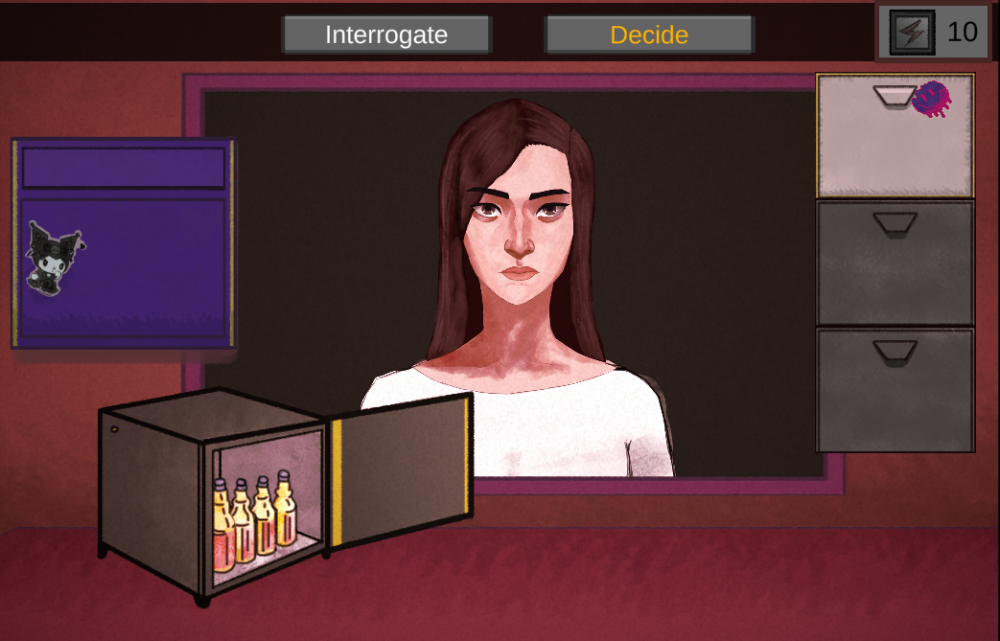

# Note: This game was originally developed for PC. A mobile port was made purely for compliance reasons. Some features may not translate perfectly—thanks for your understanding! 🙏

# 🗳️ Vote Me Not! [Demo]

**Vote Me Not!** is a **2D Satirical Political MOBILE Game** where players take on the role of a moral arbiter, deciding which politicians should run for office—or be sent packing. In a world full of flawed candidates, questionable policies, and suspicious smiles, it's up to *you* to sift through the nonsense and determine who's fit to lead.

Inspired by the game *"That's Not My Neighbor"*, but with a sharp political twist.

> This project is a student-led indie Horror Game created as part of our requirement for the Mobile Communication class. Do note that this repository contains all the Unity Files. If you want to experience the game itself, you'll have to build it first.
---
> Disclaimer: This game features fictionalized depictions inspired by real-life political figures. If you are deeply devoted to any political figure, you may find the content satirical or provocative. Player discretion is advised.
---

## 🎮 Game Overview

- **Genre:** 2D Political Satire / Simulation
- **Perspective:** Side View (2D)
- **Theme:** Satirical, Dark Humor, Social Commentary

---

## 🧠 Core Concept

In **Vote Me Not!**, every round introduces a series of politicians—each with questionable backgrounds, oddball policies, and hidden agendas. Your job is to:

- **Investigate** candidates
- **Review** their issues, their stances, and political profiles
- **Accept or Reject** them based on how “qualified” they are (or not)
- Survive the public backlash (and absurdity) of modern politics

No one is perfect, but some are *a little too imperfect*.

---

## 🖌️ Acknowledgements

**Samantha Caoile** – Artist for the politician assets  
She also one of the core members to our other project, **TikTik** (check it out here → [TikTik on GitHub](https://github.com/sjsjcezar/TikTik-GameDev2))

---

## 🏗️ Development Notes

> This is a **Demo Build**. More candidates, deeper systems, and branching scenarios are planned for future updates.

---

